```{r setup, include=FALSE}
knitr::opts_chunk$set(
	echo = FALSE,
	message = FALSE,
	warning = FALSE
)
library(knitr)

setwd("~/github/NeuralNetworksProject/Report/HTML") # Pietro Monticone 
#setwd("~/GitHub/NeuralNetworksProject/Report/HTML") # Claudio Moroni  
#setwd("Q:\\tooBigToDrive\\plantsvillage\\Report\\report") # Claudio Moroni  
```

# **Abstract** {.unnumbered}

In this effort we train a CNN model in order to take part in the [Plant Pathology 2020 - FGVC7](https://www.kaggle.com/c/plant-pathology-2020-fgvc7/discussion/141015), an image classification task where we ultimately achieved a categorical roc score of 0.972 using [denseNet121](https://keras.io/api/applications/densenet/#densenet121-function), and 0.937 using a relatively shallow CNN defined and trained from scratch. The train and the test datasets are both composed of 1821 images, showing various leaves which are to be classified in 4 categories: "healthy", "multiple disases", "rust", "scab". In the end, we also output a visulization of the filters and activation maps of the layers, and an SVD decomposition of the dataset. The techniques we used during training are balancing classes with SMOTE, data augemntation with Keras ImageDataGenerator, optimal dropout and epoch grid searching. Where possible, also auxiliary elements of the pipeline (e.g. SMOTE) have been manually fine tuned.

The evaluation metric is the [column-averaged ROC](#roc).<br>


# **Data**

Both the training and the test [datasets](https://www.kaggle.com/c/plant-pathology-2020-fgvc7/data) are composed of 1821 high-quality, real-life symptom images of multiple apple foliar diseases, with variable illumination, angles, surfaces, and noise have been manually captured, expert-annotated to create a pilot dataset for apple scab, cedar apple rust, and healthy leaves. 

```{r input-images , echo=FALSE, fig.align='center', fig.cap = "**Figure.** Input Images", message=FALSE, warning=FALSE, paged.print=FALSE}
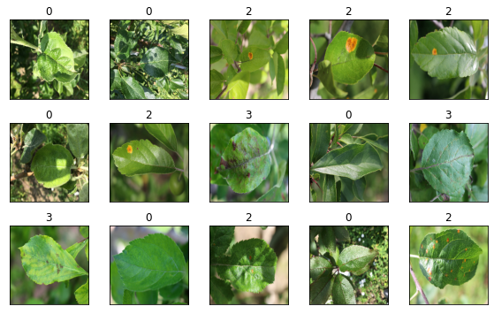
```

The Challenge consisted in classifying leaves images into four categories: HEALTHY ($h$), MULTIPLE_DISEASES ($m$), RUST ($r$), SCAB ($s$). Altough a MULTIPLE_DISEASES leaf could be affected both by rust and scab, or by rust and another disease or by scab and another disease, because there is no taxonomy we treated the classes as mutually exclusive. This is to say that in principle the model should distinguish between all four classes, as none of them is an abstraction of (some of) the others. Il dataset non risulta bilanciato, bensì distribuito nel modo seguente $(h = 516, m = 91, r = 622, s = 592)$. 

Di seguito andiamo a rappresentare le prime due componenti di una [Truncated SVD](#pca) per identificare qualitativamente se le classi distinte sono clusterizzate. Come è ragionevole pensare per elementi così complessi ciò non risulta immediatamente possibile. Si può tuttavia apprezzare l'amplificazioen classi di `SMOTE` e verificare che i punti generati clusterizzano come prevedibile.

Di seguito andiamo a rappresentare le prime due componenti principali di una [Truncated SVD](#pca) per identificare qualitativamente se il dataset sia linearmente separabile (ipotizzando che se così fosse allora la direzione in cui le classi si separano sia una delle principali a maggior varianza ritenuta, altrimenti avremmo un rumore maggior del segnale). Come è ragionevole pensare per punti a così alta dimensonalità non è così. Nelle sezioni successive è descritto un conseguente [tentativo con autoencoder](#). Tuttavia nella sezione successiva si può apprezzare l'amplificazione classi di `SMOTE` e verificare che i punti generati clusterizzano.

```{r pre-smote, echo=FALSE, fig.align='center', fig.cap = "**Figure.** Truncated SVD", message=FALSE, warning=FALSE, paged.print=FALSE}
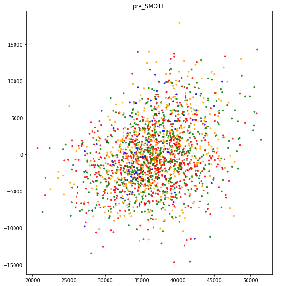
```


# **Class Balancing with `SMOTE`**


`SMOTE(sampling_strategy,k_neighbors)` is a class balancing algorithm that operates as follows: (one of) the minority class(es) is considered, a random point from it is picked and its first `n_neighbors` nearest neighbors are found. One of the latters is then randomly selected, and the the vector between this point and the originally selected point is drawn. This vector gets then multiplied by a number between 0 and 1, and the resulting synthetic point is added to the dataset. <br>
There exist many variants of **SMOTE**, so besides the standard one also the **SVMSMOTE** and **ADASYN** have been tried. <br>
**SVMSMOTE** is a variant of **SMOTE** that first of all fits an SVM on the data, and uses its support vectors to identify points more prone to misclassification (i.e. those on the border of the class cluster): these points are later oversampled more than the others.<br>
**ADASYN** instead draws from a distribution over the minority class(es) that is pointwise inversely proportional to their density. That is, more points are generated where the minority class(es) are sparser, and less points where they are more dense.<br>
Anyway, the class balancing algorithm that ultimately performed better is baseline **SMOTE**,  with some fine tuning on the `sampling_strategy`( the `all` value means that all classes are resampled to match the size of the majority class), and the `n_neighbors` parameters. See [Platform limitations](#limitations).

```{r post-smote, echo=FALSE, fig.align='center', fig.cap = "**Figure.** Truncated SVD", message=FALSE, warning=FALSE, paged.print=FALSE}
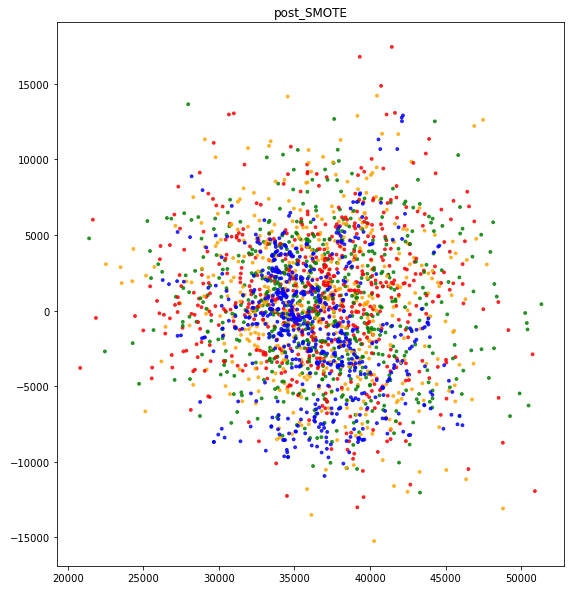
```

# **Data Augmentation with Keras `ImageDataGenerator`**

Click the following link for an introduction to [keras Image preprocessing API](https://keras.io/api/preprocessing/image/). Using Keras' ImageDataGenerator, after a manual inspection of the images, we founfd that the best data augmentin technique consisted in a random planar rotation, mixed with random horizontal flip.

# **Model Architecture Exploration**

An extensve esploration of all models has been performed. here we report the *gridsearch* that ultimately proved better.
* Some fine-tuning/exploration of the models' layers and parameters, in particular a dropout layer (EKM only) 
* optimizer variations (EKM)
* optimal dropout and epoch number search
* checkpointing

We couldn't implement Early Stopping both in the EKM model and the DenseNet, as fluctuations in either validation loss, categorical accuracy and column-averaged ROC where too high to set proper `min_delta` and `patience` parameters in [TensorFlow's Early Stopping](https://www.tensorflow.org/api_docs/python/tf/keras/callbacks/EarlyStopping) implementation. With some trial and error, the best optimizer choice for the EKM proved to be the **RMSprop**, while the standard **adam** performed quite well with the DenseNet.
The manual implementations of the dropout and early stopping searches acted simultaneoulsy, so they performed like a grid search. The dropout, epoch values and weight corresponding to the best column-averaged ROC were saved and used during testing phase. Later, in order to establish the quantitative impact of stocasticity in weights initialization on the EKM, an EKM model with the best drop is trained and validated, and the best epochs of this model and its analogon trained and validated previously are compared: there was a small difference, so we decided to make three submissions: one with the baseline model re-trained on all data and with th best drop, one with a model formed from the bst weights founfd before, and one with the DenseNet. Besides fluctuatios, we noticed that the DenseNet tends to occasionally reach higher submission scores. 
Considering the fact that optimal epoch number varies with trains et size, a possible third attempt would have seen the best epoch number to use in test phase, when the model is retrained on all train data, extrapolated from a (best-epoch) vs (training set size) plot (given stocasticity was not relevant), but this has unfortunately been impossible due to two reasons:  a techinical difficulty in combining scikit's Leraning curves with a era smodel necessarily trained with generators, and platform RAM limitations.


```{r learning-rate-schedule, echo=FALSE, fig.align='center', fig.cap = "**Figure 2.** Convolutional Autoencoder", message=FALSE, warning=FALSE, paged.print=FALSE}
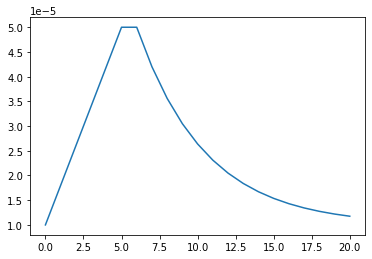
```

### Convolutional AE


Putting a Covolutional Autoencoder between the Smoted & augmented data and the model training, despite the multiple configurations tried, the best we could get is a $0.7$ column-averaged ROC. The reason behind it could be the fact that on one hand an autoencoder with no pooling on the encoder side makes little sense in terms of dimensionality reductions, while on the other hand even a single bidimensonal maxpooling caused the output image to be too little for last EKM layer to classify. See [Platform limitations](#limitations) and see [Model architecture](#model-architecture) . The only way way we managed to at least run it and see some loss drop was to build a very shallow autoencoder (just a couple of layers besides the input and the output), with the result  that the loss didn't decrease much. 
Anyway, inspired by the work of others and by some trial and error,  we had a chance to collect some architectural criteria to build an convolutional autoencoder that at least learns.  The folowing  is to be intended as an empirical recipe, with no or little theoretical foundation of the reasons behind its ingredients. The autoencoder is divided in an encoder and a decoder. The encoder should of course start with an input layer, followed by some blocks of Conv2D and Pooling layers (in our case it was MaxPooling2D). Deeper layers should have decreasing filter numbers (for images as big as ours, a range from 64 to 32 should work). The decoder should start with a specular copy of the encoder, where Conv2D layers are substituted by Conv2DTranspose,Pooling by UpSampling. The decoder shall then have as its last two layers  a BatchNormalization layer and  Conv2DTranspose with 3 filters (in order to be able to compare output with input) activated by a sigmoid (this explains the BatchNormalization layer). The unknown numner of Conv2D-pooling blocks in the encoder (that determines the number of Conv2DTranspose-UpSampling in the decoder) has to be jointly concocted with the number of Conv2D-pooling layers of the network (see [Model Architecture](#model-architecture))


```{r autoencoder, echo=FALSE, fig.align='center', fig.cap = "**Figure.** Convolutional Autoencoder", message=FALSE, warning=FALSE, paged.print=FALSE}
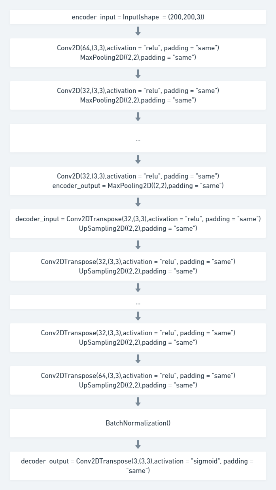
```


### Selected Model Architecture {#model-arcitecture}
Some online resaerch and trial and error with the network architecture gave us some clues about how to build from scratch an effective, dataset dependent model for image classifcation tasks. the network should of course start with a Input layer, followed by blocks of Conv2D-Pooling (MaxPooling in our case) layers. The number of these blocks should be such that the last of them outputs a representation of $n \times n$ pixels ( $\times c \, \,$ channels) where $n$ is of the order of units. This should be then followed by $1-2$ dense layers, and a final dense classifier layer. If The classification is binary (sigmoid), then the last layer should be preceeded by a BatchNormlization layer.

```{r model-architecture, echo=FALSE, fig.align='center', message=FALSE, warning=FALSE, paged.print=FALSE}
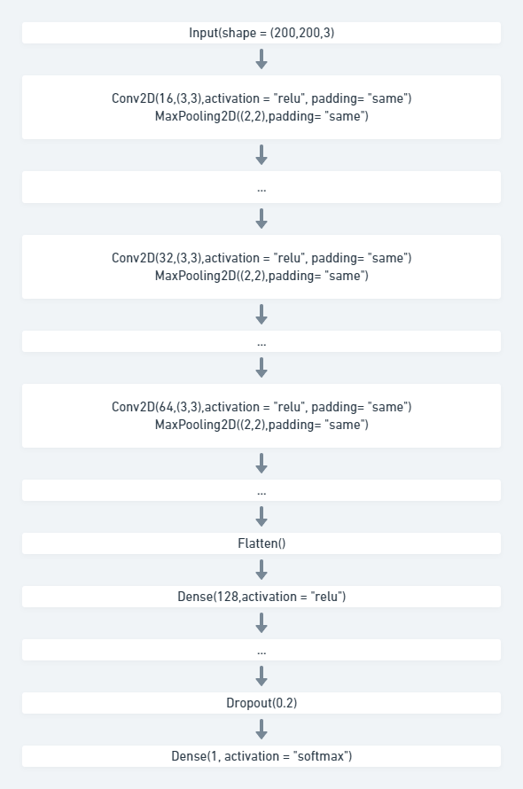 
```

# **Results**

Submissions are evaluated on **mean column-wise ROC AUC**.

* **ROC = 0.956** applying the Keras pre-trained model [DenseNet121](https://keras.io/api/applications/densenet/#densenet121-function);
* **ROC = 0.915** applying a CNN which has been defined and trained from scratch. 

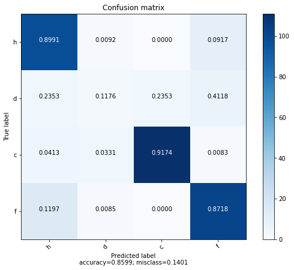 


# **Appendix** {.unnumbered}

### Platform Computational Limitations {#limitations}
The newest unstable version of TensorFlow with GPU support is needed to run the code. Unfortunately, we haven't been able to set proper kernels up on our local machines, so we had to rely on publicly available cloud interactive environments like [Kaggle](https://www.kaggle.com/), that provided free out of the box kernels for our purposes. The only limitations are in terms of cpu RAM, which forced us to downsize the images to about $200 \times 200$ pixels.

### Visualization

#### PCA {#pca}

Nonostante si sia poi stabilito di non usare la PCA per la dimensionality reduction del dataset può essere interessante visualizzare le prime dieci direzioni principali e confrontarli qualitativamente con una sequenza di direzioni principali con meno varianza ritenuta. 


```{r pca1, echo=FALSE, fig.align='center', fig.cap = "**Figure.** Layer 1-10 of PCA.", message=FALSE, warning=FALSE, paged.print=FALSE}
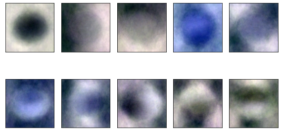
```

```{r pca200, echo=FALSE, fig.align='center', fig.cap = "**Figure.** Layer 200-210 of PCA.", message=FALSE, warning=FALSE, paged.print=FALSE}
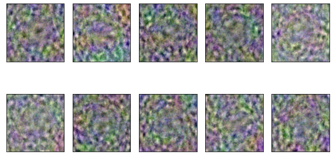
```

Come prevedibile le direzioni principali con meno varianza, se graficate, corrispondono a quasi puro rumore (si veda il contrasto tra [Fig. M](#pca1) e [Fig. M+1](#pca200) )

Di seguito viene visualizzata l'analisi dell'explained variance dove, utilizzando il criterio di conservazione del 90% della varianza, otteniamo 429 componenti.

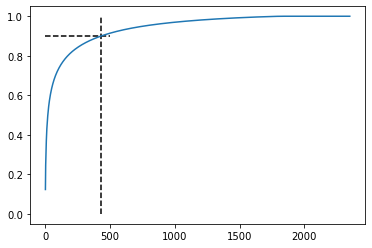

#### Convolutional Filters and Features Maps {#filters-featuremaps}


```{r filters-ekm, echo=FALSE, fig.align='center', fig.cap = "**Figure.** Filters of the EKM", message=FALSE, warning=FALSE, paged.print=FALSE}
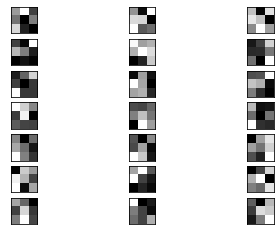
```


Convolutional neural networks, have internal structures that are designed to operate upon two-dimensional image data, and as such preserve the spatial relationships for what was learned by the model. Specifically, the two-dimensional filters learned by the model can be inspected and visualized to discover the types of features that the model will detect, and the activation maps output by convolutional layers can be inspected to understand exactly what features were detected for a given input image.

In this tutorial, you will discover how to develop simple visualizations for filters and feature maps in a convolutional neural network.

After completing this tutorial, you will know:

How to develop a visualization for specific filters in a convolutional neural network.
How to develop a visualization for specific feature maps in a convolutional neural network.
How to systematically visualize feature maps for each block in a deep convolutional neural network.
Discover how to build models for photo classification, object detection, face recognition, and more in my new computer vision book, with 30 step-by-step tutorials and full source code.


Perhaps the simplest visualization to perform is to plot the learned filters directly.

In neural network terminology, the learned filters are simply weights, yet because of the specialized two-dimensional structure of the filters, the weight values have a spatial relationship to each other and plotting each filter as a two-dimensional image is meaningful (or could be).

The first step is to review the filters in the model, to see what we have to work with.

The model summary printed in the previous section summarizes the output shape of each layer, e.g. the shape of the resulting feature maps. It does not give any idea of the shape of the filters (weights) in the network, only the total number of weights per layer.

We can access all of the layers of the model via the model.layers property.

Each layer has a layer.name property, where the convolutional layers have a naming convolution like block#_conv#, where the ‘#‘ is an integer. Therefore, we can check the name of each layer and skip any that don’t contain the string ‘conv‘.

Each convolutional layer has two sets of weights.

One is the block of filters and the other is the block of bias values. These are accessible via the layer.get_weights() function. We can retrieve these weights and then summarize their shape.

We can see that all convolutional layers use 3×3 filters, which are small and perhaps easy to interpret.

An architectural concern with a convolutional neural network is that the depth of a filter must match the depth of the input for the filter (e.g. the number of channels).

We can see that for the input image with three channels for red, green and blue, that each filter has a depth of three (here we are working with a channel-last format). We could visualize one filter as a plot with three images, one for each channel, or compress all three down to a single color image, or even just look at the first channel and assume the other channels will look the same. The problem is, we then have 63 other filters that we might like to visualize.

Now we can enumerate the first six filters out of the 64 in the block and plot each of the three channels of each filter.

Running the example creates a figure with six rows of three images, or 18 images, one row for each filter and one column for each channel

We can see that in some cases, the filter is the same across the channels (the first row), and in others, the filters differ (the last row).

The dark squares indicate small or inhibitory weights and the light squares represent large or excitatory weights. Using this intuition, we can see that the filters on the first row detect a gradient from light in the top left to dark in the bottom right.

# **References**

1. [Plant Pathology 2020 - FGVC7: Identify the category of foliar diseases in apple trees](https://www.kaggle.com/c/plant-pathology-2020-fgvc7), *Kaggle* (2020). 
1. Ranjita Thapa et al. [The Plant Pathology 2020 challenge dataset to classify foliar disease of apples](https://arxiv.org/abs/2004.11958), *arXiv pre-print* (2020). 
1. Gao Huang et al. [Densely Connected Convolutional Networks](https://arxiv.org/abs/1608.06993), *arXiv pre-print* (2018). 
