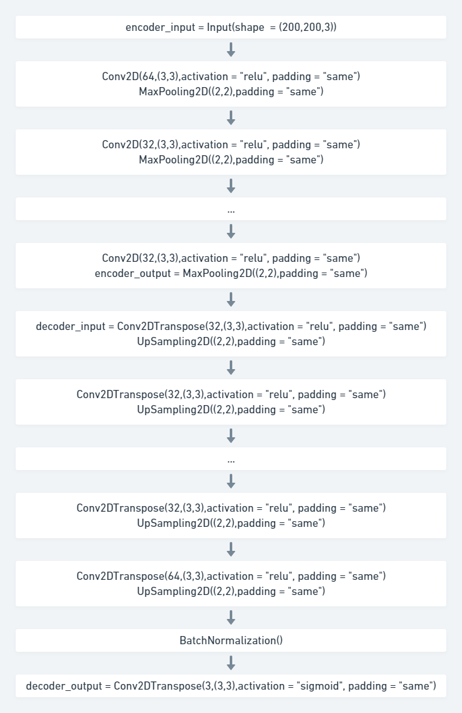
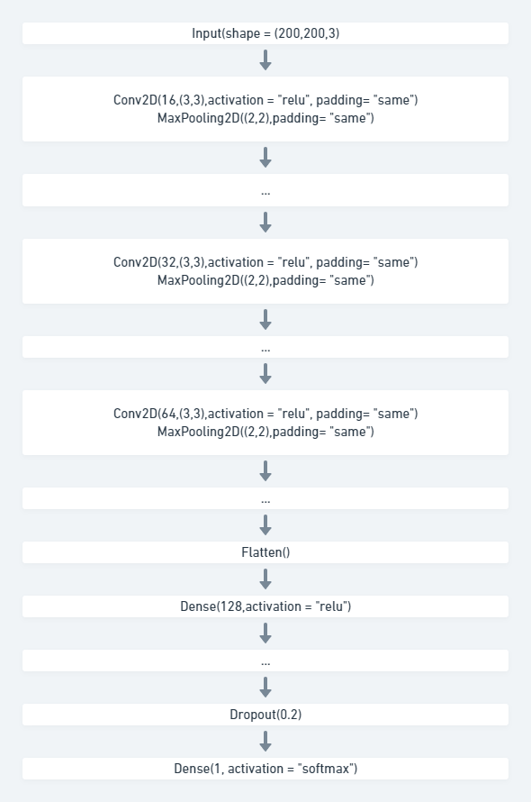
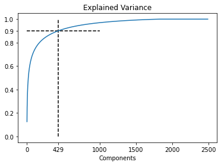
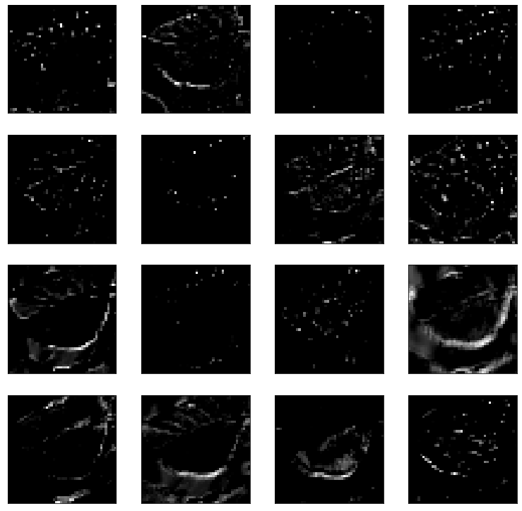
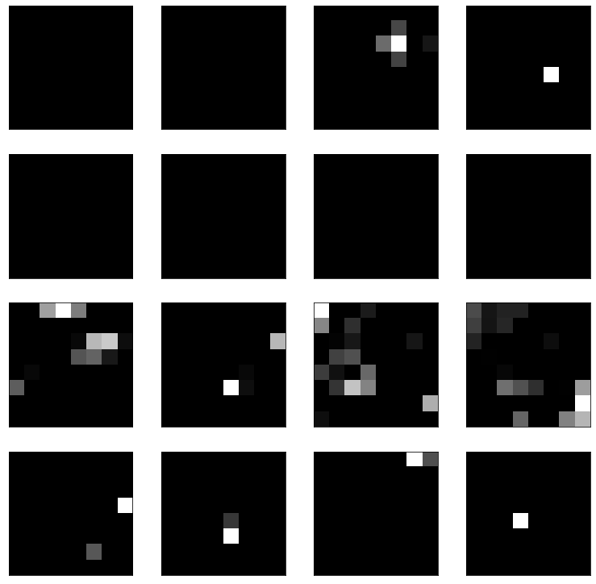

```{r setup, include=FALSE}
knitr::opts_chunk$set(
	echo = FALSE,
	message = FALSE,
	warning = FALSE
)
library(knitr)

setwd("~/github/NeuralNetworksProject/Report") # Pietro Monticone 
#setwd("~/GitHub/NeuralNetworksProject/Report") # Claudio Moroni  
#setwd("Q:\\tooBigToDrive\\plantsvillage\\Report\\report") # Claudio Moroni  
```

### **Abstract** 

We have attended the Kaggle challange *Plant Pathology 2020 - FGVC7*. In this effort we have trained a convolutional neural network model with the given training dataset to classify testing images into different disease categories. During the training phase we have adopted class balancing, data augmentation, optimal dropout, epoch grid searching and, wherever possible, we have also manually fine-tuned the auxiliary elements of the pipeline. The SVD decomposition of the dataset, the convolutional filters and activation maps have been visualized. We have ultimately achieved a mean column-wise ROC AUC of 0.937 applying `EKM`, a relatively shallow CNN defined and trained from scratch, and 0.972 applying the pre-trained Keras model `DenseNet121`.

## **Problem**

Misdiagnosis of the many diseases impacting agricultural crops can lead to misuse of chemicals leading to the emergence of resistant pathogen strains, increased input costs, and more outbreaks with significant economic loss and environmental impacts. Current disease diagnosis based on human scouting is time-consuming and expensive, and although computer-vision based models have the promise to increase efficiency, the great variance in symptoms due to age of infected tissues, genetic variations, and light conditions within trees decreases the accuracy of detection.

## **Data**

Both the training and the testing datasets are composed of 1821 high-quality, real-life symptom images of multiple apple foliar diseases to be classified into four categories: `healthy` ($h$), `multiple_diseases` ($m$), `rust` ($r$), `scab` ($s$). 

Altough a leaf labeled as `multiple_diseases` could be affected by a variety of diseases including rust, scab or both, we treated the classes as mutually exclusive because there is no taxonomy: in principle the model should distinguish between all four classes, as none of them is an abstraction of any of the others. The dataset is not balanced, but distributed as follows $(h = 516, m = 91, r = 622, s = 592)$. 

```{r input-images, echo=FALSE, fig.align='center', fig.cap="**FIGURE 1.** Sample of training images.", message=FALSE, warning=FALSE, out.height=500, out.width=800, paged.print=FALSE}

```

Even if we have ultimately decided not to apply the **PCA** to reduce the dimensionality of the dataset, we believe it might be interesting to visualize the first ten principal directions and qualitatively compare them with a sequence of principal directions with lower retained variance. As we can appreciate in the figures reported in the [Appendix](#pca), the principal components with lower retained variance correspond to almost pure noise and from the retained variance assesment (using the criterion of 90% variance retention) we have obtained 429 components.

Here instead we visualize the first two principal components of a **truncated SVD** to qualitatively investigate the linear separability of the dataset ^[**Assumption**: if the dataset is linearly separable, the direction along which which the classes diverge is one of the principal components  with larger retained variance, otherwise the noise would be greater than the signal.]. 

```{r pre-smote, echo=FALSE, fig.align='center', fig.cap = "**FIGURE 2.** Pre-`SMOTE` truncated SVD.", out.width=450, out.height=450, message=FALSE, warning=FALSE, paged.print=FALSE}

```

As one could have resonably expected given such a high dimensionality, the dataset is not linearly separable. 

Later in the report we will describe an attempt using a [convolutional autoencoder](#ae), while in the next section we can verify the amplification of the classes performed by `SMOTE` and recognize the clustering of the generated points.  


## **Methods** {#methods}

### Class Balancing with `SMOTE` {#smote}

`SMOTE(sampling_strategy, k_neighbors)` is a class balancing algorithm that operates as follows:

1. (one of) the minority class(es) is considered ;
1. a point is randomly chosen and its first `n_neighbors` nearest neighbors are found ;
1. one of those nearest neighbors is then randomly selected, and the vector between this point and the originally selected point is drawn ;
1. this vector is multiplied by a number between 0 and 1, and the resulting synthetic point is added to the dataset. 

Besides the baseline variant, `SVMSMOTE` and `ADASYN` have been tested too: 

* `SVMSMOTE` starts by fitting an SVM on the data, identifies the points which are more prone to mis-classification (i.e. those on the border of the class cluster) via its support vectors and then will oversample those points more than the others.
* `ADASYN` instead draws from a distribution over the minority class(es) that is pointwise inversely proportional to their density, so that more points are generated where the minority class(es) are sparser, and less points where they are more dense.

We have obtained the best performance applying baseline `SMOTE` with some fine-tuning on the `sampling_strategy` ^[The value `all` means that all classes are resampled to match the size of the majority class.] and the `n_neighbors` parameters. For more details see [Platform Limitations](#platform-limitations).

```{r post-smote, echo=FALSE, fig.align='center', fig.cap="**FIGURE 3.** Post-`SMOTE` truncated SVD.", out.width=450, out.height=450, message=FALSE, warning=FALSE, paged.print=FALSE}

```

### Data Augmentation with Keras `ImageDataGenerator` {#data-generator}

We have adopted the Keras `ImageDataGenerator` and, after a manual inspection of the images, we found that the best data augmentation technique was a random planar rotation combined with random horizontal flip. ^[For further information read the [Keras image pre-processing API](https://keras.io/api/preprocessing/image/).]

### Model Architecture Exploration {#exploration}

We have implemented an exploration of all models and here is reported the **grid search** that achieved the best performance:

1. some exploration and fine-tuning of the layers and parameters of the models (i.p. a dropout layer for the `EKM` only) ;
1. variations of the optimizer (for the `EKM` only) ;
1. optimal dropout and epoch number search ;
1. checkpointing .

We couldn't implement **early stopping** both in `EKM` and `DenseNet121` ^[`DenseNet121` is a CNN whose main feature relies on the connection between layers that are non contiguous (i.e. the output of the first layer is not only of the input of the second layer but also the third, fourth, etc.), which allows for feature reutilization that ultimately improves performance.], since the fluctuations in either validation loss, categorical accuracy or mean column-wise ROC AUC where too high to properly set the `min_delta` and `patience` parameters in the [TensorFlow implementation](https://www.tensorflow.org/api_docs/python/tf/keras/callbacks/EarlyStopping). 

The best choice of the optimizer for the `EKM` proved to be the `RMSprop`, while the standard `adam` performed pretty well with the `DenseNet121`. The manual implementations of the dropout and early stopping searches acted simultaneoulsy, so they performed like a grid search. The dropout, epoch values and checkpoint corresponding to the highest mean column-wise ROC AUC were saved and used during the testing phase. 

Then, in order to establish the quantitative impact of stocasticity in the initialization of the weights on `EKM`, another `EKM` (that we will call `EKM1`) with the best drop is trained and validated, and the best epochs of
the previously checkpointed model and `EKM1` are compared. There was a small
difference, therefore we decided to make three submissions: one with the
baseline `EKM` re-trained on all the data and with the best drop,
one with the checkpointed model and one with the `DenseNet121`.

Besides fluctuations, we have noticed that the `DenseNet121` tends to reach higher submission scores. See [Training Histories](#training-histories). 

### Convolutional Autoencoder {#ae}

The best we could achieve by inserting a covolutional autoencoder between the smoted data, augmented data and the model training is a 0.7 mean column-wise ROC AUC, despite the large number of the configurations that have been tried. The reason behind this relatively poor performance could be that on the one hand an autoencoder with no pooling on the encoder side makes little sense in terms of dimensionality reduction, while on the other hand even a single bidimensonal maxpooling caused the output image to be too little for the last `EKM` layer to classify. See [Platform limitations](#limitations) and [Model Architecture Exploration](#model-architecture). 

The only way way we have managed to run it and see at least some loss drop was to build a very shallow autoencoder (i.e. just a couple of layers besides the input and the output), with the result that the loss didn't decrease significantly. Anyway, inspired by the work of others and by some active trial and error,  we have had a chance to collect some architectural criteria to build a convolutional autoencoder that at least exhibits learning. The following is to be intended as an empirical recipe, with no or little theoretical foundation supporting the choice of its ingredients. 

The autoencoder is composed of an encoder and a decoder. Obviously the encoder should start with an `input` layer, followed by some blocks of `Conv2D` and `Pooling` layers. Deeper layers should have decreasing filter numbers (for images as big as ours, a range from 64 to 32 should work). The decoder should start with a specular copy of the encoder, where `Conv2D` layers are substituted by `Conv2DTranspose` and `Pooling` by `UpSampling`. Then the last two layers of the decoder should be a `BatchNormalization` layer and `Conv2DTranspose` with 3 filters (in order to be able to compare output with input) activated by a sigmoid (which explains the `BatchNormalization layer`). The unknown number of `Conv2D`-`Pooling` blocks in the encoder (that determines the number of `Conv2DTranspose`-`UpSampling` in the decoder) has to be jointly connected with the number of `Conv2D`-`Pooling` layers of the network. See [Selected Model Architecture](#model-architecture).


```{r ae, echo=FALSE, fig.align='center', fig.cap='**FIGURE 4.** Schematic representation of the convolutional autoencoder.', out.width=350, out.height=500, message=FALSE, warning=FALSE, paged.print=FALSE}

```

### Selected Model Architecture {#model-architecture}

Some online resaerch and active trial and error with the network architecture gave us some clues about how to build from scratch an effective, dataset-dependent model for image classification. 

Obviously the network should start with a `input` layer, followed by blocks of `Conv2D`-`Pooling`^[`MaxPooling` in our case.] layers. The number of these blocks should be such that the last of them outputs a representation of $n \times n$ pixels ( $\times c$ channels) where $n$ is of the order of units. Then this should be followed by 1-2 dense layers, and a final dense classifier layer. If the classification is binary (sigmoid), then the last layer should be preceeded by a `BatchNormalization` layer.

```{r basenet, echo=FALSE, fig.align='center', fig.cap='**FIGURE 5.** Schematic representation of the selected model architecture.', out.width=350, out.height=500, message=FALSE, warning=FALSE, paged.print=FALSE}

```

The first convolutional layer of the model uses 3 x 3 filters with depth of 3 ^[Equal to the number of channels of its input.]. Since the visualization of the convolutional filters within the trained `EKM` might provide insight into how the model works, in [FIGURE 13](#filters-featuremaps) we have represented the first seven filters of the first convolutional layer as rows of three subplots (one column per channel): the darker the squares the smaller the weights. 

In order to capture the application of filters to a selected testing image or deeper activation outputs and therefore trying to understand what features of the input are detected or preserved in the activation maps ^[We should verify that the maps close to the input image detect high-resolution, fine-grained detail, whereas  maps close to the model output extract coarser, more abstract concepts.], in [FIGURE 14](#filters-featuremaps), [15](#filters-featuremaps) and [16](#filters-featuremaps) we visualize a 4 x 4 matrix of subplots showing a sample of feature maps extracted from the first, the third and the fifth convolutional layer. 

## **Results**

The performance of the models has been evaluated on **mean column-wise ROC AUC**: 0.972 for `DenseNet121` and 0.937 for `EKM`.

```{r confusion-matrices, echo=FALSE, fig.align='center', fig.cap='**FIGURE 6.** Confusion matrices of `EKM` (left) and `DenseNet121` (right) on validation set.', out.width=800, out.height=550, message=FALSE, warning=FALSE, paged.print=FALSE}
library(cowplot)
library(ggplot2)
p1 <- ggdraw() + draw_image("Images/ConfusionMatrixDenseNet121.png")
p2 <- ggdraw() + draw_image("Images/ConfusionMatrixEKM.png")
plot_grid(p1, p2)
```

## **Conclusions**

Since the optimal epoch number varies with the size of training dataset, a possible third attempt to obtain it would have seen the best epoch number to use in the testing phase, when the model is re-trained on all training data, extrapolated from a `(best-epoch, training-set-size)` plot (given that stocasticity has not been relevant). 

This has been practically impossible for us because of two main reasons: technical difficulty in  combining Sci-kit learning curves with a Keras model necessarily trained with generators, and [platform limitations](#limitations). Those limitations prevented us from instantiating a single `Pipeline` object integrating all the elements (`SMOTE`, `ImageDataGenerator`, `Model`): this could have allowed us to perform a more extensive and reliable^[If coupled with *cross validation* instead of 80%-20% splitting.] grid search. Finally, as we have already mentioned, those computational limitations  prevented us from implementing an effective convolutional autoencoder: if we used the full-sized images, the autoencoder may have been deeper and that could have plausibly yielded a better performance.

## **References**

1. [Plant Pathology 2020 - FGVC7: Identify the category of foliar diseases in apple trees](https://www.kaggle.com/c/plant-pathology-2020-fgvc7), *Kaggle* (2020). 
1. Ranjita Thapa et al. [The Plant Pathology 2020 challenge dataset to classify foliar disease of apples](https://arxiv.org/abs/2004.11958), *arXiv pre-print* (2020). 

## **Appendix**

### Online Contents {#additional-material}

* Explore the [GitHub repository](https://github.com/InPhyT/NeuralNetworksProject) of the project.
* Read the code in the [Jupyter notebook](https://nbviewer.jupyter.org/github/InPhyT/NeuralNetworksProject/blob/master/Notebooks/notebook.ipynb).
* Run the code in the [Kaggle notebook](https://www.kaggle.com/inphyt2020/neuralnetworksproject).

### Platform Limitations {#platform-limitations}

Since the last unstable version of GPU-supported TensorFlow is required to run the code and we haven't been able to set the proper kernels up on our local machines, we have been constrained to rely on a publicly available cloud interactive environment like *Kaggle*, which provided free out of the box kernels for our purposes. The only limitations are in terms of CPU RAM, which forced us to downsize the images to about 200 $\times$ 200 pixels.

### Visualization

#### *PCA* {#pca}

```{r pca1, echo=FALSE, fig.align='center', fig.cap = "**FIGURE 7.** The first ten principal directions of the PCA.", out.width=800, out.height=400, message=FALSE, warning=FALSE, paged.print=FALSE}

```
```{r pca200, echo=FALSE, fig.align='center', fig.cap = "**FIGURE 8.** Directions 200-210 of the PCA.",  out.width=800, out.height=400, message=FALSE, warning=FALSE, paged.print=FALSE}

```
```{r variance, echo=FALSE, fig.align='center', fig.cap = "**FIGURE 9.** Explained variance with optimal number of components.",  out.width=550, out.height=400, message=FALSE, warning=FALSE, paged.print=FALSE}

```

#### *Training Histories* {#training-histories}

```{r ekm-training, echo=FALSE, fig.align='center', fig.cap = "**FIGURE 10.** Training history of the `EKM`.", message=FALSE, warning=FALSE, paged.print=FALSE}

```
```{r ekm1-training, echo=FALSE, fig.align='center', fig.cap = "**FIGURE 11.** Training history of the `EKM1`.", message=FALSE, warning=FALSE, paged.print=FALSE}

```
```{r densenet-training, echo=FALSE, fig.align='center', fig.cap = "**FIGURE 12.** Training history of the `DenseNet121`.", message=FALSE, warning=FALSE, paged.print=FALSE}

```

#### *Filters and Activation Maps* {#filters-featuremaps}

```{r filters-ekm, echo=FALSE, fig.align='center', fig.cap = "**FIGURE 13.** The first seven filters of the first convolutional layer of the `EKM`.", out.width=550, out.height=460, message=FALSE, warning=FALSE, paged.print=FALSE}
include_graphics("Images/FiltersEKM.png")
```
```{r maps0, echo=FALSE, fig.align='center', fig.cap = "**FIGURE 14.** Activation maps extracted from the first convolutional layer of `EKM`.", message=FALSE, warning=FALSE, paged.print=FALSE}
 
# PAY ATTENTION: Maps2 is Maps9
```
```{r maps4, echo=FALSE, fig.align='center', fig.cap = "**FIGURE 15.** Activation maps extracted from the third convolution layer of `EKM`.", message=FALSE, warning=FALSE, paged.print=FALSE}

# PAY ATTENTION: Maps6 is Maps5
```
```{r maps8, echo=FALSE, fig.align='center', fig.cap = "**FIGURE 16.** Activation maps extracted from the fifth convolution layer of `EKM`.", message=FALSE, warning=FALSE, paged.print=FALSE}

# PAY ATTENTION: Maps9 is Maps2
```

